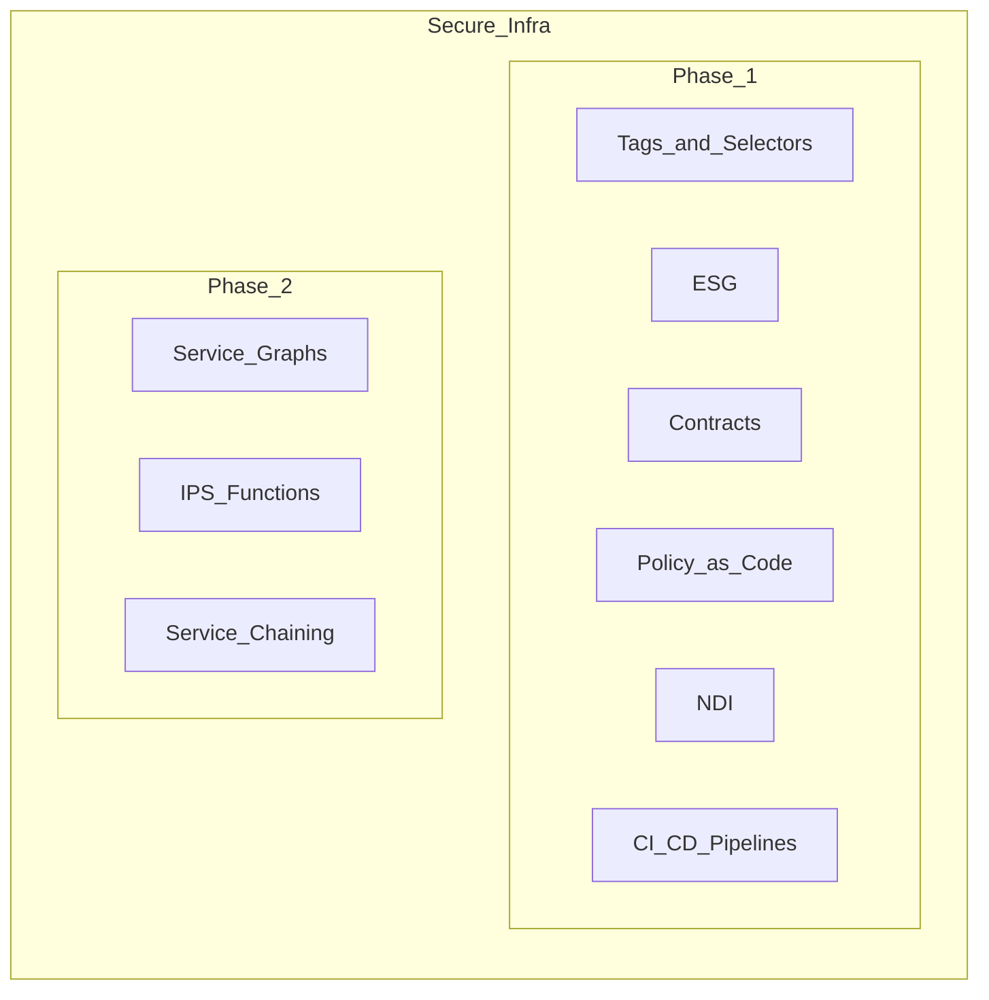
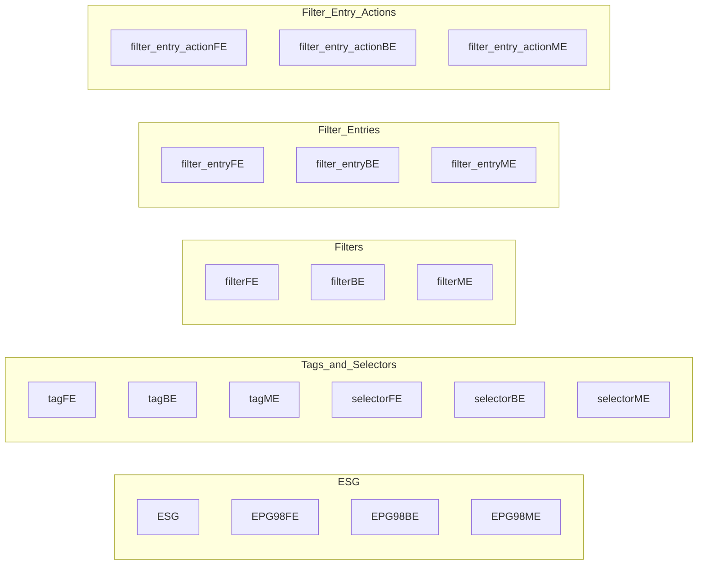

    **   ASML Gitlab Environment **

An automated solution for the deployment of ESG in the ACI fabric using Ansible and GITLAB

ASML Gitlab Environment  
Author: William Kimandu  
Team: Campus DC  
Contact Information:  
    Email:  
    Phone:  
Version: 0.4  
Date: 2025-01-19  

Testing the pipeline in a dummy ACI tenant98


### Context: Background

Within the secure infra competence group, we would like to achieve 2 key milestones: segmentation of the ACI fabric and the deployment of ESG in the ACI fabric (RING Fence candidates workloads). 
This is automated via IAC - CI/CD pipelines - GITLAB. When IAC is achieved, add Policy as Code framework to the solution. ESG - endpoint security groups is a granular security policy that can be applied to a group of endpoints.
To make sure that we have a policy on group membership, we need to have a policy on the group membership, and this solution is flexible in scope and scale.
Secure endpoint groups can leverage the ACI contracts and filters to determine the forwarding behavior of the traffic. This capability is available in ACI fabric and can be automated using Ansible and GITLAB. 
At a later stage, we may need to do deep packet inspection, and this can be achieved using the FTD and FMC. 
This then leverages service graph and service chaining, redirecting traffic to the IPS functions (FTD) for inspection and then back to the ACI fabric.

### Approach

To achieve the key milestones of segmenting the ACI fabric and deploying ESG, we will follow a phased approach:

#### Phase 1: Segmentation of the ACI Fabric Workloads
- **Tags and Selectors**: Define tags and selectors for endpoint (EP) membership.
- **ESG (Endpoint Security Groups)**: Apply granular security policies to groups of endpoints.
- **Contracts**: Establish contracts between EPGs (Endpoint Groups) and ESGs.
- **Policy as Code**: Implement policies using YAML for rules and validation, and Jinja Templates for dynamic configurations. Utilize the Robot Framework for rules and validation.
- **Leverage NDI**: Nexus dashboard insights for Pre-change validation and Post-change validation.
- **CI/CD Pipelines**: Use GitLab CI/CD pipelines to automate the workflow.

#### Phase 2: Service Graphs and Security
- **Service Graphs**: Define service graphs for traffic redirection.
- **IPS Functions**: Implement IPS functions using FTD (Firepower Threat Defense) and FMC (Firepower Management Center).
- **Service Chaining**: Redirect traffic to IPS functions for inspection and then back to the ACI fabric.
- **Policy as Code**: Implement anomaly detection and compliance rules using NDI assurance and PCV ESG rules.
- **CI/CD Pipelines**: Continue using GitLab CI/CD pipelines to automate the workflow.

### Secure Infrastructure

Provide a secure infra as code solution for the deployment of ESG in the ACI fabric using Ansible and GITLAB. We are tasked with automating the deployment of ESG in the ACI fabric. 
The deployment will be done using Ansible, and the code will be stored in a GITLAB environment. The following steps will guide you on how to create a GITLAB environment in the ACI fabric.

### Ansible

Collections:
- ND: `ansible-galaxy collection install cisco.nd`
  - Clone repos: `https://github.com/CiscoDevNet/ansible-nd.git`
  - README: `https://github.com/CiscoDevNet/ansible-nd?tab=readme-ov-file`
- ACI: `ansible-galaxy collection install cisco.aci`
  - Clone repos: `https://github.com/CiscoDevNet/ansible-aci.git`
README: `https://github.com/CiscoDevNet/ansible-aci/blob/master/README.md`

Roles:
- Pipelines: GitHub Actions or Jenkins

YAML:
- Rules and Validation: Robot Framework
- Jinja Templates: Dynamic configurations

```yaml
---
name: Create ESG in ACI Fabric
description: Create ESG in ACI Fabric
author: wkimand1
version: 1.0
collections:
    - cisco.aci
    - cisco.nd
   

Utilities:
    var: cisco aci
    var: cisco nd
    var: cisco dcauto

global_vars:
    - cisco_aci
    - cisco_nd
    - cisco_dcauto
```

### Ansible: ACI environments ASML Gitlab

User: wkimand1

```yaml
aci:
  host: "https://apiclvg02"
  username: "wkimand1"
  target_tenant: "tenant98 (lvg)"
  ND: NRW - (details)
  Secrets: vault - `ansible-vault encrypt_string 'password' --name 'password'`
  YAML variable inputs
  Jinja Templates
  configuration inputs
  Pre-change validation (NDI NRW)
  ESG rules
  compliance rules
  post-change validation (NDI NRW)
  Gitlab - CI/CD pipelines
  esg_create:
    cisco.aci.aci.esg_create (refine)
    items:
    - name: "esg1"
      tenant: "tenant98"
      vrf: "vrf98"
      ap: "ap98"
      epg: ["epg98FE", "epg98BE", "epg98ME"] (or VLANs ids 3510 - 3515)
      bd: ["bd98FE", "bd98BE", "bd98ME"]
      subnet: ["subnetFE", "subnetBE", "subnetME"]
      subnet_mask: ["25", "25", "25"]
      contract: ["contractFE", "contractBE", "contractME"]
      tags: ["tagFE", "tagBE", "tagME"]
      selectors: ["selectorFE", "selectorBE", "selectorME"]
      filters: ["filterFE", "filterBE", "filterME"]
      filter_entries: ["filter_entryFE", "filter_entryBE", "filter_entryME"]
      filter_entry_actions: ["filter_entry_actionFE", "filter_entry_actionBE", "filter_entry_actionME"]
```

### Jenkins - Pipeline

GitHub Actions - Pipeline  
Robot Framework - Validation ==> Compliance rules in NDI NRW

```yaml
---
name: NDI PCV ESG rules
description: NDI PCV ESG rules
author: wkimand1
version: 1.0
collections:
    - cisco.nd
    - cisco.dcauto
snapshot_import_from: EID Tenant13 ()
snapshot_export_to: NDI NRW PCV ESG rules
```



